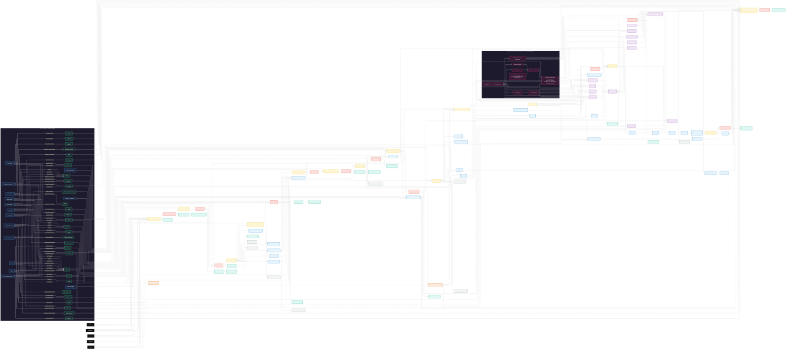

# Complete Progression Graph

```mermaid
---
config:
  theme: redux-dark
  layout: elk
---

flowchart LR

    %% =====================================
    %% MAIN PROGRESSION
    %% =====================================

    %% Roots / rackets
    MACHR["Machinist"]
    PROV["Provisioner"]
    RITU["Ritualist"]
    SURV["Surveyor"]
    OUTF["Outfitter"]

    %% Early / core tech
    MELT["Meltery + Workstations"]
    CW["Copper / Wrought Tier"]
    ALLOY["Alloying + Casting"]
    BRZ["Bronze Tier"]
    BRASS["Brass Tier"]
    BLOG["Brass Logistics"]
    MACH["First Machine Blocks + Mechanical / Heat Industry"]
    STL["Steel Tier"]

    %% Mid / late tech
    NETH["Nether / Cobalt Access"]
    COB["Cobalt Tier"]
    SKYG["End Stone + Sky Steel Forge"]
    SKY["Sky Steel Tier"]
    SPACE["Space Travel"]
    TNG["Tungsten Tier"]
    SLUR["Sophisticated Slurries"]
    NEO["Neodymium Tier"]
    GRID["Grid Power"]
    OBE["Sustained Obelisk Operations"]
    DRAG["Dragon Kill"]
    HAF["Hafnium Tier"]
    POST["Post-space"]
    EUR["Europium Tier"]
    EVIL["Evil Biome Chain"]
    TEN["Tennessine Tier"]
    SYN["Advanced Synthesis / ChemLib Traversal"]
    QNT["Quantum Alloy"]

    %% Logistics
    L_LOCAL["Local Rail Networks"]
    L_TRAIN["Long-Distance Trains"]
    L_VAN["Vanilla Rails + Couplings"]
    L_LIT["Little Logistics"]
    L_HELP["Starbuncles / Spirits"]
    L_REMOTE["Remote Site Integration"]
    L_EMERALD["Emerald Trade Economy"]
    L_VILL["Villager Parallel Systems"]

    %% Nutrition / combat prep
    NUTRI["Nutrition System"]
    COMBAT["Late Combat Buff Family"]

    %% Death-native schools
    BLOOD["Blood Magic"]
    MALUM["Malum"]
    EID["Eidolon"]
    OCC["Occultism"]

    %% Reformist schools
    ARS["Ars Nouveau"]
    HEX["Hex Casting"]
    MNA["Mana and Artifice"]
    MAHOU["Mahou Tsukai"]
    IRONS["Iron's Spells"]

    %% Cross-school / unification
    MIDMAG["Mid Magic"]
    LAE2["Local AE2"]
    CTRL["AE2 Controller"]
    AMAT["Advanced Magic Materials"]

    %% Tech satellites
    ATCH["Advanced Tech Materials"]
    AEAD["Ad Hoc AE2"]
    EMOT["Electric Motors / Heaters"]
    FISS["Fission"]
    FUS["Fusion"]

    %% Space / territory
    MOON["Moon"]
    MARS["Mars"]
    VENUS["Venus"]
    FAL["Fallout Planet"]
    EV1["Evil I"]
    EV2["Evil II"]
    EV3["Evil III"]
    EV4["Evil IV"]
    DEEP["Deep Underworld\nY 0 to -64"]

    %% Bosses
    PNB["Post-Normal Bosses"]
    BOSSMAT["Boss Materials"]
    ALLB["All Bosses Cleared"]
    IAF["Ice and Fire"]

    %% Casings / machine roles
    SEAR["Seared Casing"]
    ANDE["Andesite Casing"]
    BCAS["Bronze Casing"]
    BRCAS["Brass Casing"]
    STCAS["Steel Casing"]
    SCOR["Scorched Casing"]
    SKCAS["Sky Steel Casing"]
    TGCAS["Tungsten Casing"]
    NECAS["Neodymium Casing"]
    HFCAS["Hafnium Casing"]
    EUCAS["Europium Casing"]
    TECAS["Tennessine Casing"]
    QCAS["Quantum Alloy Casings"]

    NPM["Non-Processing Machines"]
    BASIC["Basic Machines"]
    FIN["Finesse Machines"]
    ADV["Advanced Machines"]
    LOGI2["Advanced Logistics"]

    %% Side unlocks
    SRAIL["Steam 'n' Rails"]
    OREEX["Ore Excavation"]
    DIESEL["Diesel / Oil / Biodiesel"]
    SCHEM["Schematic Construction"]
    TICK["Tick / Speed / Cells"]
    BIOM["Biomancy / Parallel Tech"]
    BUILD["Big Build Tools"]
    PERM["Permanent Building Space"]

    %% Root flow
    MACHR --> MELT
    PROV --> MELT
    RITU --> MELT
    SURV --> MELT
    OUTF --> MELT

    MACHR -.-> MACH
    PROV -.-> NUTRI
    RITU -.-> MIDMAG
    SURV -.-> L_REMOTE
    OUTF -.-> COMBAT

    %% nutrition family
    PROV --> NUTRI
    OUTF --> NUTRI
    NUTRI --> COMBAT
    COMBAT --> OBE
    COMBAT --> DRAG
    COMBAT --> PNB

    %% Core tier law
    MELT --> CW
    CW --> ALLOY
    ALLOY --> BRZ
    BRZ --> BRASS
    BRASS --> BLOG
    BLOG --> MACH
    MACH --> STL
    STL --> NETH
    NETH --> COB
    COB --> SKYG
    SKYG --> SKY
    SKY --> SPACE
    SPACE --> TNG
    TNG --> SLUR
    SLUR --> NEO
    NEO --> GRID
    GRID --> OBE
    OBE --> DRAG
    DRAG --> HAF
    HAF --> POST
    POST --> EUR
    EUR --> EVIL
    EVIL --> TEN
    TEN --> SYN
    SYN --> QNT

    %% Logistics
    BLOG --> L_LOCAL
    BLOG --> L_TRAIN
    BLOG --> L_VAN
    BLOG --> L_LIT
    BLOG --> L_HELP

    L_VAN --> L_LOCAL
    L_LOCAL --> L_REMOTE
    L_TRAIN --> L_REMOTE
    L_LIT --> L_REMOTE
    L_HELP --> L_REMOTE
    L_REMOTE --> OBE
    L_REMOTE --> SPACE

    OBE --> L_EMERALD
    L_EMERALD --> L_VILL

    %% Magic overall shape
    MIDMAG --> LAE2
    LAE2 --> CTRL
    AMAT --> CTRL
    POST --> CTRL

    %% Death-native first readers of the substrate
    BLOOD --> MIDMAG
    MALUM --> MIDMAG
    EID --> MIDMAG
    OCC --> MIDMAG

    %% Reformist schools sit downstream of standardized intermediates
    MIDMAG --> ARS
    MIDMAG --> HEX
    MIDMAG --> MNA
    MIDMAG --> MAHOU
    MIDMAG --> IRONS

    ARS --> AMAT
    HEX --> AMAT
    MNA --> AMAT
    MAHOU --> AMAT
    IRONS --> AMAT

    DRAG --> BLOOD
    DRAG --> PNB

    %% Advanced tech / synthesis
    SLUR --> ATCH
    GRID --> AEAD
    GRID --> EMOT
    GRID --> FISS
    EVIL --> FUS

    ATCH --> LAE2
    ATCH --> CTRL

    ATCH --> SYN
    CTRL --> SYN
    FISS --> SYN
    FUS --> SYN
    AMAT --> SYN

    %% Space / late territory
    SPACE --> MOON
    MOON --> MARS
    MARS --> VENUS
    SPACE --> FAL

    MOON --> POST
    MARS --> POST
    VENUS --> POST
    FAL --> POST

    POST --> EV1
    EV1 --> EV2
    EV2 --> EV3
    EV3 --> EV4
    EV4 --> DEEP
    DEEP --> EVIL

    %% Bosses
    DRAG --> PNB
    PNB --> BOSSMAT
    BOSSMAT --> ALLB
    ALLB --> IAF

    BOSSMAT --> EVIL
    BOSSMAT --> TEN

    %% Casings / machine roles
    MELT --> SEAR
    CW --> ANDE
    BRZ --> BCAS
    BRASS --> BRCAS
    STL --> STCAS
    STL --> SCOR
    SKY --> SKCAS
    TNG --> TGCAS
    NEO --> NECAS
    HAF --> HFCAS
    EUR --> EUCAS
    TEN --> TECAS
    QNT --> QCAS

    ANDE --> NPM
    BCAS --> BASIC
    BRCAS --> FIN
    STCAS --> ADV
    SKCAS --> LOGI2

    %% Side unlock satellites
    BLOG --> SRAIL
    BLOG --> OREEX
    MACH --> DIESEL
    STL --> SCHEM
    GRID --> TICK
    GRID --> BIOM
    CTRL --> BUILD
    SPACE --> PERM

    %% =====================================
    %% ORE PROCESSING SUBGRAPH
    %% =====================================
    subgraph CHEMBREAK["Ore -> Process -> ChemLib Outputs"]
        O_CU["Copper Sulfide"]
        O_FE["Ironstone"]
        O_TIN["Tin"]
        O_ZN["Zinc"]
        O_LZ["Lead / Zinc Vein"]
        O_NI["Nickel Sulfide"]
        O_S["Sulfur Pyrite"]
        O_P["Phosphate Rock"]
        O_TIO["Titanium / Iron Oxide"]
        O_TW["Tin / Tungsten Greisen"]
        O_TH["Thorium Ore"]
        O_U["Uranium Ore"]
        O_END["End Stone / Skystone"]
        O_MTN["Mountain Materials"]
        O_MET["Meteor Obelisks"]

        CH_CU["Copper"]
        CH_FE["Iron"]
        CH_TIN["Tin"]
        CH_ZN["Zinc"]
        CH_S["Sulfur"]
        CH_AU["Gold"]
        CH_MN["Manganese"]
        CH_NI["Nickel"]
        CH_V["Vanadium"]
        CH_PB["Lead"]
        CH_CD["Cadmium"]
        CH_QZ["Quartz"]
        CH_W["Tungsten"]
        CH_AG["Silver"]
        CH_SB["Antimony"]
        CH_CO["Cobalt"]
        CH_PGM["PGM"]
        CH_PHO["Phosphorus / Phosphate"]
        CH_CACO3["Calcium Carbonate"]
        CH_P["Phosphorus"]
        CH_TI["Titanium"]
        CH_CR["Chromium"]
        CH_BI["Bismuth"]
        CH_TH["Thorium"]
        CH_U["Uranium"]
        CH_REE["REE"]
        CH_PBRA["Pb/Ra Residue"]
        CH_RA["Radium"]
        CH_RADRES["Radioactive Residue"]
        CH_AS["Arsenic"]

        O_CU -- "basic smelting" --> CH_CU
        O_CU -- "roasting / gas recovery" --> CH_S
        O_CU -- "slag separation" --> CH_FE
        O_CU -- "deep precious recovery" --> CH_AU

        O_FE -- "basic smelting" --> CH_FE
        O_FE -- "alloying-grade separation" --> CH_MN
        O_FE -- "deep sulfide recovery" --> CH_NI
        O_FE -- "advanced trace extraction" --> CH_V

        O_TIN -- "basic smelting" --> CH_TIN
        O_TIN -- "gangue separation" --> CH_QZ
        O_TIN -- "deep refractory recovery" --> CH_W
        O_TIN -- "late impurity recovery" --> CH_FE

        O_ZN -- "basic smelting" --> CH_ZN
        O_ZN -- "lead split" --> CH_PB
        O_ZN -- "toxic trace recovery" --> CH_CD
        O_ZN -- "deep impurity separation" --> CH_FE

        O_LZ -- "basic split" --> CH_PB
        O_LZ -- "basic split" --> CH_ZN
        O_LZ -- "silver recovery" --> CH_AG
        O_LZ -- "sulfide roasting" --> CH_S
        O_LZ -- "toxic trace recovery" --> CH_CD
        O_LZ -- "deep trace recovery" --> CH_SB

        O_NI -- "basic smelting" --> CH_NI
        O_NI -- "iron separation" --> CH_FE
        O_NI -- "deep sulfide recovery" --> CH_CO
        O_NI -- "gas recovery" --> CH_S
        O_NI -- "precious trace recovery" --> CH_PGM

        O_S -- "roasting" --> CH_S
        O_S -- "basic slag split" --> CH_FE
        O_S -- "secondary recovery" --> CH_CU
        O_S -- "deep precious recovery" --> CH_AU
        O_S -- "toxic trace recovery" --> CH_AS

        O_P -- "basic processing" --> CH_PHO
        O_P -- "gangue separation" --> CH_CACO3
        O_P -- "deep chemical refinement" --> CH_P
        O_P -- "late rare-earth recovery" --> CH_REE

        O_TIO -- "primary beneficiation" --> CH_TI
        O_TIO -- "iron split" --> CH_FE
        O_TIO -- "deep alloying recovery" --> CH_V
        O_TIO -- "late trace recovery" --> CH_CR

        O_TW -- "basic refractory split" --> CH_W
        O_TW -- "secondary recovery" --> CH_TIN
        O_TW -- "gangue separation" --> CH_QZ
        O_TW -- "deep trace recovery" --> CH_BI

        O_TH -- "primary recovery" --> CH_TH
        O_TH -- "late rare-earth recovery" --> CH_REE
        O_TH -- "deep fissile split" --> CH_U
        O_TH -- "oxide recovery" --> CH_TI
        O_TH -- "radioactive residue handling" --> CH_PBRA

        O_U -- "primary recovery" --> CH_U
        O_U -- "lead split" --> CH_PB
        O_U -- "secondary fissile split" --> CH_TH
        O_U -- "radiological refinement" --> CH_RA
        O_U -- "radioactive residue handling" --> CH_RADRES
    end

    %% Ore outputs -> main progression
    CH_CU --> MELT
    CH_CU --> GRID

    CH_FE --> MELT
    CH_FE --> STL

    CH_TIN --> ALLOY
    CH_TIN --> BRASS

    CH_ZN --> ALLOY
    CH_ZN --> BRASS

    CH_QZ --> BRASS

    CH_MN --> STL
    CH_NI --> STL
    CH_NI --> ATCH
    CH_PB --> ATCH
    CH_AG --> CTRL

    CH_S --> SLUR
    CH_PHO --> SLUR

    CH_TI --> ATCH
    CH_TI --> SYN

    CH_V --> SLUR

    CH_W --> TNG
    CH_W --> SYN

    CH_CO --> COB

    CH_TH --> FISS
    CH_U --> FISS

    CH_REE --> CTRL
    CH_CD --> GRID

    CH_CR --> SYN
    CH_BI --> SYN
    CH_PGM --> SYN
    CH_SB --> SYN
    CH_AS --> SYN
    CH_RA --> SYN
    CH_PBRA --> SYN
    CH_RADRES --> SYN

    O_END --> SKYG
    O_MTN --> SLUR
    O_MET --> OBE

    %% =====================================
    %% REMNANT / MAGIC ECONOMY SUBGRAPH
    %% =====================================
    subgraph REMNANTSYS["Death -> Remnant -> Native Interpretation -> Standardized Magic"]
        DEATH["Death Event"]
        REM["Raw Remnant"]
        ANCHOR["Anchor Remnant"]
        SUPPORT["Support Remnants"]
        LATTICE["Remnant Lattice"]
        FEED["Recurring Inputs\nblood / ash / reagents / fluids / metals / slurries"]
        OUT["Heartless Standardized Intermediates\nvitiae / spirit residue / mnemonic ash / necromantic salts / bound echoes"]
        WHOLE["Whole-Remnant Apex Expenditure"]
        FRAC["Fractionation"]
        PARTS["Lesser Reagents"]

        DEATH --> REM
        REM --> ANCHOR
        REM --> SUPPORT
        REM --> WHOLE
        REM --> FRAC
        FRAC --> PARTS

        ANCHOR --> LATTICE
        SUPPORT --> LATTICE
        FEED --> LATTICE
        LATTICE --> OUT
    end

    %% Native readers consume raw remnants
    REM --> BLOOD
    REM --> MALUM
    REM --> EID
    REM --> OCC

    %% Support economy
    PARTS --> BLOOD
    PARTS --> MALUM
    PARTS --> EID
    PARTS --> OCC

    %% Native schools generate standardized intermediates
    BLOOD --> OUT
    MALUM --> OUT
    EID --> OUT
    OCC --> OUT

    %% Reformist schools consume translated products, not raw substrate
    OUT --> ARS
    OUT --> HEX
    OUT --> MNA
    OUT --> MAHOU
    OUT --> IRONS

    %% Whole-remnant apex uses
    WHOLE --> AMAT
    WHOLE --> SYN
    WHOLE --> CTRL

    %% Styling
    classDef tier fill:#e74c3c,fill-opacity:0.18,stroke:#e74c3c,stroke-width:2px,color:#fff0f0;
    classDef gate fill:#f1c40f,fill-opacity:0.18,stroke:#f1c40f,stroke-width:1.5px,color:#fffbe6;
    classDef detail fill:#3498db,fill-opacity:0.12,stroke:#3498db,color:#ecf6ff;
    classDef magic fill:#9b59b6,fill-opacity:0.16,stroke:#9b59b6,color:#f5ecff;
    classDef casing fill:#1abc9c,fill-opacity:0.14,stroke:#1abc9c,color:#eafffb;
    classDef side fill:#95a5a6,fill-opacity:0.12,stroke:#95a5a6,color:#f5f7f7;
    classDef combat fill:#e67e22,fill-opacity:0.16,stroke:#e67e22,color:#fff3e8;
    classDef chem fill:#2ecc71,fill-opacity:0.14,stroke:#2ecc71,color:#ecfff2;
    classDef remnant fill:#c2255c,fill-opacity:0.16,stroke:#c2255c,color:#fff0f6;

    class CW,BRZ,BRASS,STL,COB,SKY,TNG,NEO,HAF,EUR,TEN,QNT tier;
    class MELT,ALLOY,BLOG,MACH,NETH,SKYG,SPACE,SLUR,GRID,OBE,DRAG,POST,EVIL,SYN gate;
    class O_CU,O_FE,O_TIN,O_ZN,O_LZ,O_NI,O_S,O_P,O_TIO,O_TW,O_TH,O_U,O_END,O_MTN,O_MET,L_LOCAL,L_TRAIN,L_VAN,L_LIT,L_HELP,L_REMOTE,L_EMERALD,L_VILL,ATCH,AEAD,EMOT,FISS,FUS,MOON,MARS,VENUS,FAL,EV1,EV2,EV3,EV4,DEEP,PNB,BOSSMAT,ALLB,IAF detail;
    class BLOOD,MALUM,EID,OCC,ARS,HEX,MNA,MAHOU,IRONS,MIDMAG,LAE2,CTRL,AMAT magic;
    class SEAR,ANDE,BCAS,BRCAS,STCAS,SCOR,SKCAS,TGCAS,NECAS,HFCAS,EUCAS,TECAS,QCAS,NPM,BASIC,FIN,ADV,LOGI2 casing;
    class SRAIL,OREEX,DIESEL,SCHEM,TICK,BIOM,BUILD,PERM side;
    class NUTRI,COMBAT combat;
    class CH_CU,CH_FE,CH_TIN,CH_ZN,CH_S,CH_AU,CH_MN,CH_NI,CH_V,CH_PB,CH_CD,CH_QZ,CH_W,CH_AG,CH_SB,CH_CO,CH_PGM,CH_PHO,CH_CACO3,CH_P,CH_TI,CH_CR,CH_BI,CH_TH,CH_U,CH_REE,CH_PBRA,CH_RA,CH_RADRES,CH_AS chem;
    class DEATH,REM,ANCHOR,SUPPORT,LATTICE,FEED,OUT,WHOLE,FRAC,PARTS remnant;
```
